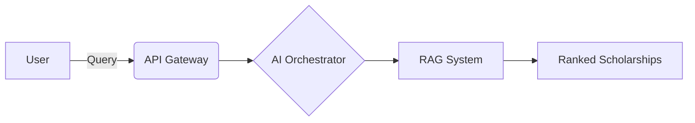

  
  &nbsp;&nbsp;
  
  
   
  
  <h1>🎓 SamvaadAI   <i>Scholarship Intelligence System</i></h1>

  

    <strong>A next-generation AI-powered scholarship discovery engine.</strong> 
    <i>Reasoning, ranking, and semantic search to help students find the best funding opportunities.</i>
  

  

    <a href="#-core-innovation">Core Innovation</a> •
    <a href="#-architecture">Architecture</a> •
    <a href="#-tech-stack">Tech Stack</a> •
    <a href="#-future-scope">Future Scope</a>
  

  

    🌍 <b>Live Demo:</b> <a href="https://web-theta-three-17.vercel.app/">Frontend (Vercel)</a> | 
    🔌 <b>API:</b> <a href="https://atlas-scholarship-api.onrender.com">Backend (Render)</a>
  

---

## 🚀 Why this system exists

We're tired of traditional scholarship platforms. They usually suck because they are:
- 🔍 **Strictly keyword-based** (you miss things if you don't use the exact word)
- 📋 **Dependent on static, rigid filters**
- ❌ **Lacking personalization**

**SamvaadAI is different.** It leverages **AI reasoning + embeddings + ranking intelligence** to find what truly fits *you*.

---

## 🧠 Core Innovation

- **Eligibility is not filtered** — it is logically reasoned by an AI agent reading between the lines.
- **Scholarships are not searched** — they are retrieved semantically via Vector Embeddings, understanding the *meaning* behind your profile.
- **Recommendations are not listed** — they are ranked intelligently based on multi-variable metrics.

---

## 🏗️ Architecture

### 🤖 AI Components

1. **Eligibility Reasoning Agent**: Uses LLMs to evaluate strict constraints.
2. **Scholarship Ranking Engine**: Mathematically weighs multiple fit vectors.
3. **Recommendation Agent**: Formulates a personalized application strategy.
4. **Deadline Optimization Agent**: Prioritizes workflow urgency.

### 📊 Scoring Model

Your final match score is a weighted blend of:
- `(Eligibility × 0.40)`
- `(Deadline × 0.25)`
- `(Financial Fit × 0.20)`
- `(User Preference × 0.15)`

---

## ⚙️ Tech Stack

We're built on a modern, robust, and scalable stack:

- **Frontend**: Next.js / React / TailwindCSS
- **API Framework**: FastAPI / Node.js
- **Intelligence**: OpenAI / Custom LLM APIs
- **Vector DB**: FAISS / Pinecone
- **Relational DB**: PostgreSQL / SQLite
- **Orchestration**: Celery & Redis

---

## 🔮 Future Scope

- [ ] **Fully autonomous scholarship application agent**
- [ ] **PDF form auto-filler**
- [ ] **Multi-agent decision system**
- [ ] **Personalized funding roadmap generator**

---

  
<i>Turning scholarship discovery into an AI decision system, not just a search tool.</i>

