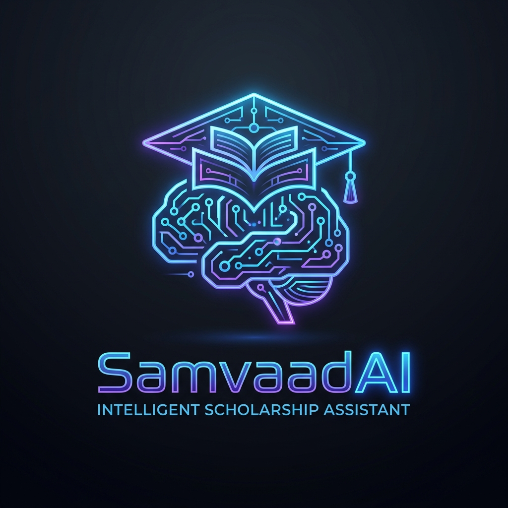

<div align="center">
  
  
  # SamvaadAI
  
  ### Autonomous Scholarship Intelligence Platform
  
  [](https://nextjs.org/)
  [](https://react.dev/)
  [](https://tailwindcss.com/)
  [](https://www.typescriptlang.org/)
  [](https://fastapi.tiangolo.com/)
</div>

<br />

> **SamvaadAI is a next-generation Educational Funding Operating System.** It transitions scholarship AI from simply answering *"What scholarships are out there?"* to proactively predicting *"Which scholarships are you guaranteed to win?"*. Featuring dynamic profile analysis, a highly interactive cybernetic user interface, and multi-agent reasoning.

---

## 🏗️ 5-Layer Platform Architecture

Our system is engineered to scale from a simple student portal into a full enterprise-grade scholarship matching engine.

### 1. Student Experience Layer
- **Interactive Student Twin:** A dynamic virtual profile of the student's academic and extracurricular achievements that evolves over time.
- **Cybernetic Dashboard:** Live matching scores, application timelines, and automated document tracking.

### 2. AI Agent Layer (Multi-Agent Reasoning)
- **Scraper & Opportunity Agents:** Automates the extraction and translation of complex scholarship eligibility requirements across thousands of websites.
- **Matching & Prediction Agents:** Forecasting application success rates and identifying immediate critical deadlines.
- **Essay & Application Agents:** Providing holistic, personalized writing pathways and review workflows.

### 3. Scholarship Intelligence Layer
- **Knowledge Graph & Educational RAG:** Ensuring high-accuracy, explainable AI matching based on specific student demographics.
- **Evidence & Eligibility Engines:** Every prediction explicitly shows the *Why?* (e.g., Match Score 92% due to First-Generation Status, STEM Major, High GPA).

### 4. Data Layer
- **Vector & Graph Storage:** Utilizing advanced vector databases for semantic matching of essays and complex eligibility relationships.

### 5. Infrastructure Layer
- **Cloud Native:** FastAPI Python backend and Next.js frontend, deployed with robust CI/CD pipelines.

---

## 🗺️ The 5-Phase Roadmap

SamvaadAI is actively being developed in 5 distinct phases to achieve the ultimate vision of a research-grade Educational Funding OS.

### 🟢 Phase 1: Foundation (In Progress)
- [x] High-contrast Cybernetic UI & Landing Page
- [x] Student Login and Authentication
- [x] Central Student Dashboard
- [ ] Initial Scholarship Database Integration

### 🟡 Phase 2: AI Vision & Extraction
- [ ] Upload processing for Transcripts, Resumes, and existing Essays.
- [ ] Automated AI extraction of student achievements.
- [ ] Explainability UI (Showing the *Why* behind the scholarship matches).

### 🟠 Phase 3: The Student Twin
- [ ] Initial mapping of student data to a Virtual Academic Clone.
- [ ] Interactive timeline of upcoming deadlines and funding goals.

### 🔵 Phase 4: Application Automation
- [ ] Component-level application breakdowns.
- [ ] Automated generation of essay drafts based on the Student Twin.

### 🟣 Phase 5: Agentic Educational OS
- [ ] Full deployment of the Multi-Agent layer.
- [ ] Graph-RAG integration for complex financial aid queries.
- [ ] University, Sponsor, and Student Portals online.

---

## 💻 Local Development

To run the SamvaadAI platform locally:

```bash
# Clone the repository
git clone https://github.com/saichintamani/scholarship-assistant.git

# Navigate into the project
cd scholarship-assistant

# Install frontend dependencies
cd apps/web
npm install

# Start the frontend development server
npm run dev
```

Visit `http://localhost:3000` to access the platform.

### Backend Setup
```bash
# From the root directory, navigate to the API
cd apps/api
python -m venv .venv
source .venv/bin/activate  # On Windows: .venv\Scripts\activate
pip install -r requirements.txt
uvicorn api.main:app --reload
```

---

## 📹 Comprehensive Demo

Check out the full journey of our platform, from the landing page, through the AI analysis, to the Customer Care portal!


---

<div align="center">
  <p>Engineered by <strong>Sai Chintamani</strong></p>
  <p>
    <a href="mailto:saichintamani5@gmail.com">Contact Support</a> | 
    <a href="https://linkedin.com/in/sai-chintamani">LinkedIn Profile</a> |
    <a href="https://github.com/saichintamani/scholarship-assistant">GitHub Repository</a>
  </p>
</div>
